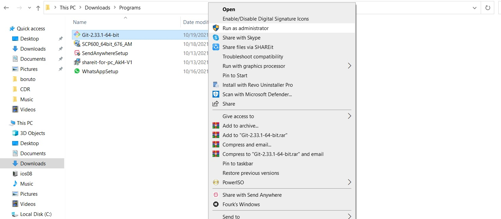
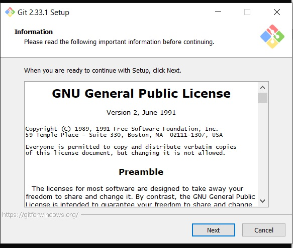
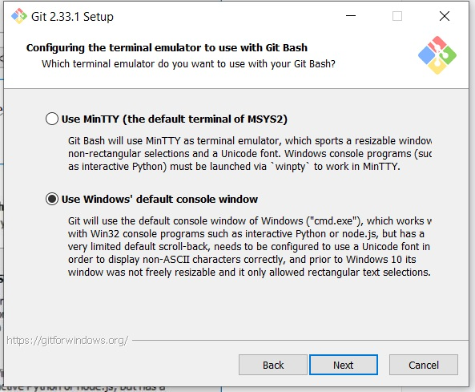
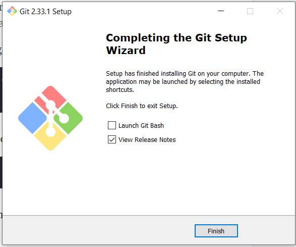
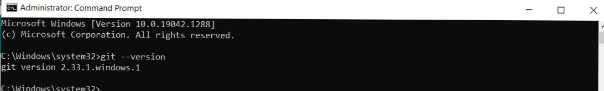
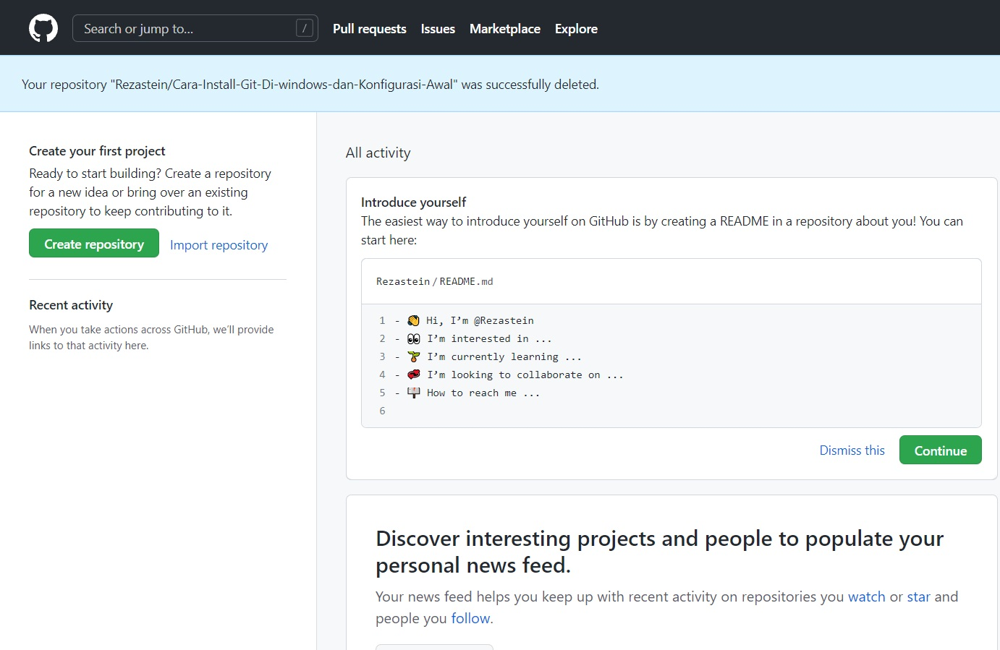
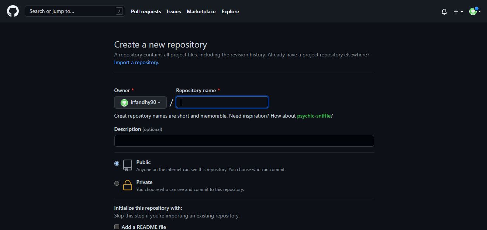

# **Cara Install Git  dan Cara Menggunakan Git**
## **Install Git**
Instalasi Git di Windows memang tidak seperti di Linux yang ketik perintah langsung terinstal.
Kita harus men-download dulu, kemudian melakukan ritual next>next>finish.

### **Download Git**
Silahkan buka website resminya Git : https://git-scm.com/


klik kanan dan run as administrator file instaler Git yang sudah diunduh.


Maka akan muncul infomasi lisensi Git, klik Next > untuk melanjutkan.

Selanjutnya menentukan lokasi instalasi. Biarkan saja apa adanya, kemudian klik Next >> sampai muncul sebagai berikut:

Selanjutnya pemilihan emulator terminal. Pilih saja yang bawah, kemudian klik Next >.

Setelah selesai, kita bisa langsung klik Finish.


Selamat, Git sudah terinstal di Windows. Untuk mencobanya, silahkan buka CMD atau PowerShell, kemudian ketik perintah 
```sh
git --version
```

# **Cara penggunaan Git**

Setelah berhasil install ke Git, selanjutnya
## **Login Git**

masukkan username & email Git menggunakan perintah di bawah ini. Lalu tekan ENTER jika sudah benar.

```sh
git config --global user.name "User Name"
git config --global user.email email@gmail.com
```
Selanjutnya untuk memastikan proses login berhasil, masukkan perintah berikut.
```sh
git config --list
```

## **Login Github**
Langkah kedua menggunakan Git adalah harus login ke dalam website GitHub. Github dan Git memiliki hubungan khusus, yaitu Git yang berperan sebagai version control system dan Github menjadi hosting atau sebagai penyimpan kode pemrograman.




## **Buat Repository**
Setelah berhasil login ke GitHub, Anda bisa mulai membuat repository. Klik tombol New pada menu Repositories untuk membuat repository baru.


Kemudian akan diarahkan pada halaman untuk membuat repository baru seperti gambar di bawah ini.
perlu mengisi detail informasi berikut:

```Nama Repository``` : digunakan untuk identitas repository yang dibuat.
<br>
```Deskripsi Repository``` : berfungsi untuk deskripsi dari repository yang dibuat.
<br>
```Jenis Repository```   : jenis repository  dibagi menjadi Public dan Private. Ketika Anda mengatur repository menjadi Public, orang lain dapat melihat repository yang Anda buat. Sebaliknya, jika Anda mengaturnya sebagai Private, repository tersebut hanya bisa diakses oleh Anda.
Setelah mengisi detail informasi di atas, 
<br>
klik ```Create Repository```.

## **Membuat Git Init**
Setelah itu, ubah folder tersebut menjadi repository menggunakan perintah berikut:
```sh
git init
```
## **Tambahkan File ke Repository**
Untuk bisa menambahkan file ke repository GitHub,perlu menerapkan langkah-langkah di bawah ini:

Buat file di folder yang sudah dibuat (Eza-Git). Contohnya, di sini  membuat file javascript : index.php
Buka GitBash lalu masukkan perintah berikut:
```
git add index.php
```
Perintah tersebut tidak akan menghasilkan output apa pun.

## **Buat Commit**
Selanjutnya, perlu membuat Commit. Commit berfungsi untuk menambahkan update file serta komentar. Jadi setiap kontributor bisa memberikan konfirmasi update file di proyek yang sedang dikerjakan. Masukkan perintah berikut untuk membuat Commit:
```sh
git commit -m "first commit"
```


## **Remote Repository Github**
Remote repository berfungsi untuk mengupload file yang telah di buat sebelumnya di local disk. Masukkan perintah berikut ini untuk melakukan remote repository:
```sh
git branch -M main
git remote add origin https://github.com/namaRepo/namaGit.git
```
Perintah di atas tidak akan menghasilkan output apa pun.

## **Push ke GitHub**
Langkah terakhir adalah push ke GitHub Push ini berfungsi untuk mengupload hasil akhir dari langkah-langkah di atas. Masukkan perintah berikut untuk melakukan push ke GitHub:
```sh
git push -u origin main
```


